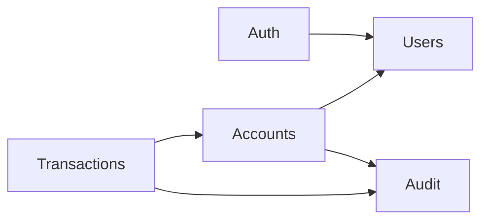

# 4. Arquitectura

> **Estado:** aceite · **Data:** 29 de Setembro de 2026

Arquitectura é o conjunto de decisões **difíceis de mudar depois**. Cada decisão importante tem um ADR em [`adr/`](adr/).

## Estilo: monólito modular

Uma só aplicação NestJS dividida em módulos com fronteiras claras. Uma transferência precisa de **uma única transacção ACID** (RNF-03); com microserviços exigiria transacções distribuídas, muito mais complexas e sem ganho para este âmbito. Ver [ADR-001](adr/ADR-001-monolito-modular.md).

## Camadas dentro de cada módulo

`Controller` (recebe HTTP, valida a entrada) → `Service` (regras de negócio) → `Repositório/ORM` (base de dados).

**Regra de ouro:** as regras de negócio não conhecem HTTP. O *Service* não sabe se foi chamado por um pedido web, um teste ou um script.

## Módulos NestJS e dependências

```
AppModule
├─ ConfigModule        (variáveis de ambiente, validadas no arranque)
├─ DatabaseModule      (ligação à BD, transacções, migrações)
├─ AuthModule          (login, JWT, guards de perfil)   → Users
├─ UsersModule         (utilizadores e clientes)
├─ AccountsModule      (contas, estados, limites)       → Users, Audit
├─ TransactionsModule  (operações e movimentos)         → Accounts, Audit
├─ AuditModule         (registo e consulta)
└─ common/             (Dinheiro, filtro de erros, decorators)
```



As setas só vão numa direcção, **sem dependências circulares**: `Transactions` conhece `Accounts`, mas `Accounts` nunca conhece `Transactions`.

## Preocupações transversais (resolvidas uma vez, para todos)

| Preocupação | Solução |
|---|---|
| Autenticação | JWT de acesso de curta duração, sem *refresh tokens* no MVP ([ADR-003](adr/ADR-003-jwt-curto-sem-refresh.md)). |
| Autorização | *Guards* por perfil, protegido por omissão (RNF-11). |
| Validação | DTOs com `class-validator`, lista branca de campos e `ValidationPipe` global (RNF-06, RNF-12). |
| Erros | Filtro global que devolve sempre o mesmo formato, sem expor detalhes internos. |
| Limitação de pedidos | Módulo de *throttling*, mais estrito no login (RNF-10). |
| Auditoria | Ver a subtileza abaixo. |

## A subtileza da auditoria

Numa transferência bem-sucedida, o registo de auditoria vai **dentro da mesma transacção**: ou tudo é gravado, ou nada. Se a transferência **falhar**, a transacção faz *rollback*, e um registo de falha lá dentro desapareceria com ela, quando o RF-11 exige justamente o rasto das falhas. Por isso os registos de falha são gravados **fora** da transacção de negócio, depois do *rollback*. Ver [ADR-007](adr/ADR-007-auditoria-de-falhas-fora-da-transaccao.md).

## Concorrência (RNF-05)

**Bloqueio pessimista de linhas** (`SELECT ... FOR UPDATE`): quando uma transferência começa, bloqueia as contas envolvidas até terminar, e uma segunda operação na mesma conta espera. Em contas movimentadas é mais previsível do que o bloqueio *optimista*. O protocolo detalhado está no documento 5 e no [ADR-006](adr/ADR-006-bloqueio-pessimista-ordenado.md).

## Decisões

| # | Decisão | Razão |
|---|---|---|
| 1 | Monólito modular. | Uma transacção ACID única; equipa de uma pessoa; prazo curto. |
| 2 | **TypeORM** (em vez de Prisma). | Suporta bloqueio pessimista e transacções explícitas de forma nativa; o requisito mais valioso (RNF-05) fica expresso na própria ferramenta. |
| 3 | JWT de acesso curto, sem *refresh tokens* no MVP. | Menos peças e menos superfície de ataque; os *refresh tokens* ficam como evolução. |
