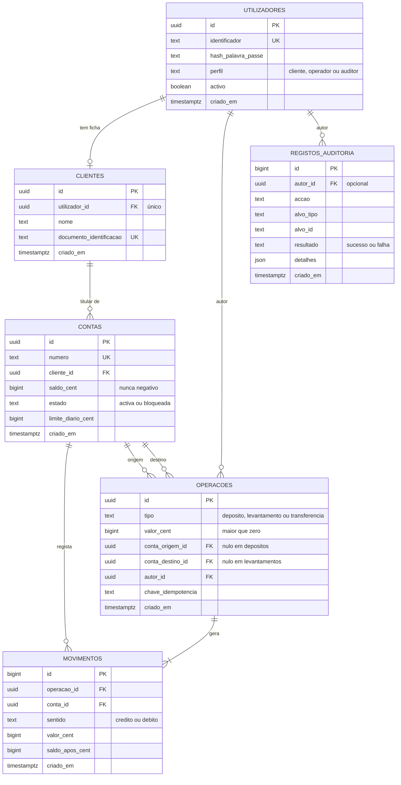
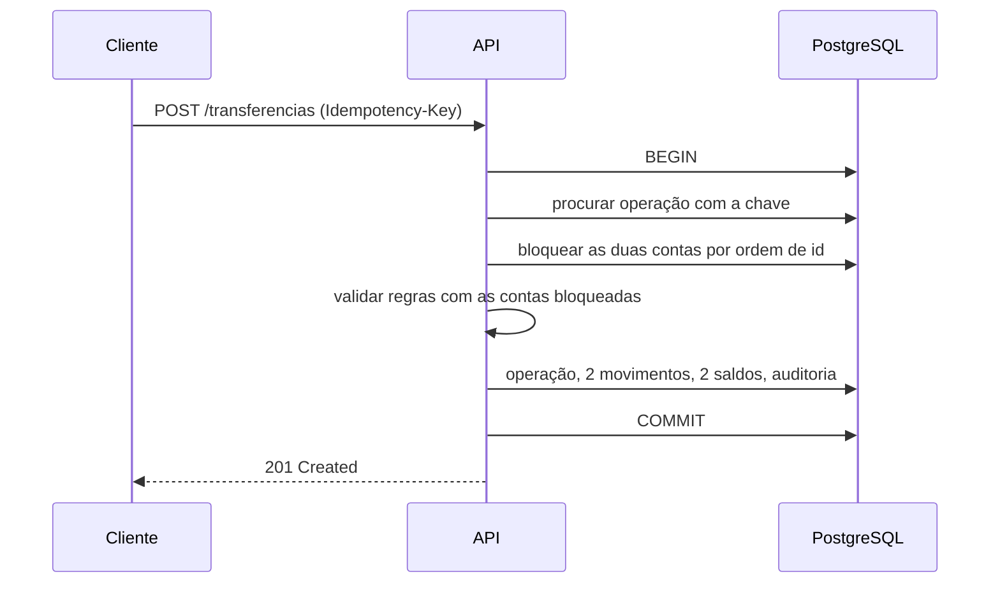

# 5. Modelo de dados

> **Estado:** aceite · **Data:** 29 de Setembro de 2026 · **SGBD:** PostgreSQL

## Princípios

1. **A base de dados é a última linha de defesa.** Regras críticas (saldo não negativo, valor positivo) vivem também na BD, como restrições. O código pode ter um bug; uma restrição `CHECK` não deixa passar.
2. **Nunca `CASCADE` em dados financeiros.** Todas as chaves estrangeiras são `RESTRICT`.
3. **Índices nascem das consultas**, não de palpites.
4. **Tempo sempre em UTC** (`timestamptz`); o fuso só entra na apresentação e em regras como "o dia" do limite diário.

## Diagrama entidade-relação

## Tabelas

### utilizadores

| Coluna | Tipo e restrições |
|---|---|
| id | UUID, PK |
| identificador | texto, único, obrigatório |
| hash_palavra_passe | texto, obrigatório |
| perfil | enum (cliente, operador, auditor), obrigatório |
| activo | booleano, obrigatório, por omissão verdadeiro |
| criado_em | timestamptz, obrigatório |

### clientes

| Coluna | Tipo e restrições |
|---|---|
| id | UUID, PK |
| utilizador_id | UUID, FK → utilizadores, **único** (garante a relação 1:1) |
| nome | texto, obrigatório |
| documento_identificacao | texto, único, obrigatório (fictício) |
| criado_em | timestamptz, obrigatório |

### contas

| Coluna | Tipo e restrições |
|---|---|
| id | UUID, PK |
| numero | texto, único, obrigatório (código fictício gerado pelo sistema, sem formato IBAN) |
| cliente_id | UUID, FK → clientes, obrigatório |
| saldo_cent | bigint, obrigatório, **CHECK ≥ 0** (I-1) |
| estado | enum (activa, bloqueada), obrigatório |
| limite_diario_cent | bigint, obrigatório, CHECK ≥ 0 |
| criado_em | timestamptz, obrigatório |

### operacoes

| Coluna | Tipo e restrições |
|---|---|
| id | UUID, PK |
| tipo | enum (deposito, levantamento, transferencia), obrigatório |
| valor_cent | bigint, obrigatório, **CHECK > 0** (I-2) |
| conta_origem_id | UUID, FK → contas, nulo em depósitos |
| conta_destino_id | UUID, FK → contas, nulo em levantamentos |
| autor_id | UUID, FK → utilizadores, obrigatório |
| chave_idempotencia | texto, opcional |
| criado_em | timestamptz, obrigatório |

Restrições adicionais: numa transferência, origem e destino são obrigatórios e **diferentes** (I-4); o par (autor, chave de idempotência) é **único** quando a chave existe (RF-14).

### movimentos (imutável)

| Coluna | Tipo e restrições |
|---|---|
| id | bigint, identidade (sequencial) |
| operacao_id | UUID, FK → operacoes, obrigatório |
| conta_id | UUID, FK → contas, obrigatório |
| sentido | enum (credito, debito), obrigatório |
| valor_cent | bigint, obrigatório, CHECK > 0 |
| saldo_apos_cent | bigint, obrigatório, CHECK ≥ 0 |
| criado_em | timestamptz, obrigatório |

### registos_auditoria (imutável)

| Coluna | Tipo e restrições |
|---|---|
| id | bigint, identidade (sequencial) |
| autor_id | UUID, FK → utilizadores, **opcional** (um login falhado pode não ter utilizador conhecido) |
| accao | texto, obrigatório |
| alvo_tipo, alvo_id | texto, opcionais (o que foi afectado) |
| resultado | enum (sucesso, falha), obrigatório |
| detalhes | JSON, opcional (motivo da falha, valores) |
| criado_em | timestamptz, obrigatório |

## Índices e porquê

| Índice | Serve |
|---|---|
| movimentos (conta_id, criado_em desc, id) | O extracto (RF-10): movimentos de uma conta num período, do mais recente para o mais antigo. |
| movimentos (operacao_id) | Ir de uma operação aos seus dois movimentos. |
| operacoes (conta_origem_id, criado_em) | A verificação do limite diário. |
| registos_auditoria (criado_em), (autor_id, criado_em), (accao) | Os filtros que o auditor mais usa. |
| contas (cliente_id) | Listar as contas de um cliente. |
| Únicos | identificador, número de conta, documento, (autor, chave de idempotência). |

## Imutabilidade (I-7)

Movimentos e auditoria só se acrescentam. Um *trigger* na base de dados rejeita qualquer `UPDATE` ou `DELETE` nestas duas tabelas, para que nem um bug no código consiga reescrever a história. Ver [ADR-008](adr/ADR-008-imutabilidade-por-trigger.md).

## Protocolo da transferência

Numa única transacção (isolamento *read committed*, suficiente porque usamos bloqueios explícitos):

1. **Idempotência:** se já existe uma operação com esta chave para este autor, devolve o resultado anterior e termina.
2. **Bloquear as duas contas** (`FOR UPDATE`), **sempre por ordem crescente de id**.
3. **Validar as regras** já com as contas bloqueadas: ambas activas, a origem pertence ao autor, saldo suficiente, limite diário respeitado.
4. **Escrever:** criar a operação, os dois movimentos, actualizar os dois saldos e registar a auditoria de sucesso.
5. **Confirmar** a transacção.

Se qualquer passo falhar: *rollback* e, **fora** da transacção, registo da falha na auditoria.

**Porquê a ordem por id (o *deadlock*).** Se a Ana transfere para o Bruno no mesmo instante em que o Bruno transfere para a Ana, sem ordem cada transacção bloqueia uma conta e fica à espera da outra, para sempre. Se ambas bloqueiam **sempre a de menor id primeiro**, uma espera pela outra em vez de se cruzarem.

**Porquê validar depois de bloquear.** Se o saldo e o limite fossem verificados antes do bloqueio, duas transferências simultâneas poderiam ambas passar a verificação com os mesmos números. Com o bloqueio primeiro, a segunda só lê o saldo depois de a primeira terminar. É assim que o RNF-05 fica cumprido.

## Reconciliação (I-6)

Como guardamos o saldo, precisamos de o poder verificar: para cada conta, o saldo tem de ser igual à soma dos créditos menos a soma dos débitos nos movimentos. Usa-se num teste automático e como consulta de diagnóstico.

## Decisões

| # | Decisão | Razão |
|---|---|---|
| 1 | **Identificadores híbridos:** UUID para utilizadores, clientes, contas e operações; inteiro sequencial para movimentos e auditoria. | UUIDs não são adivinháveis (evitam experimentar `/contas/1`, `/contas/2`); nas tabelas só de acrescentar, a ordem estável é útil. |
| 2 | **Imutabilidade por *trigger***, em vez de retirar permissões de escrita à aplicação. | Mais simples de montar com migrações do TypeORM; as permissões exigiriam dois utilizadores de base de dados. |
| 3 | **O "dia" do limite diário conta-se em Africa/Luanda**, com timestamps em UTC. | Sem isto o limite reiniciaria à 01:00 da manhã em Angola. |
| 4 | Número de conta fictício gerado pelo sistema, sem imitar o IBAN. | Não prometer o que o projecto não é. |
